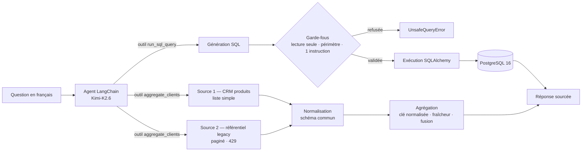

# sorabel-data-ko

Couche d'accès aux données de l'assistant **Sorabel**. Le service traduit des
questions en langage naturel en requêtes SQL exécutées sur la base de
démonstration, et agrège en parallèle des données provenant de plusieurs
sources externes (CRM produits, référentiel clients) avant de répondre via un
agent LangChain (LLM Kimi-K2.6 hébergé sur Azure AI Foundry).

> **Statut : chantier de remédiation.** Le dépôt est livré avec un agent qui
> renvoie des chiffres faux. La mission consiste à réparer le lien entre
> l'agent et les données — voir [Mission](#mission) et
> [État des lieux](#état-des-lieux--diagnostic).

## Mission

*Situation professionnelle : connecter les agents aux données de l'entreprise,
de façon sécurisée.* Un agent utile reste coupé des données métier — bases SQL,
sources multiples, base de connaissances. Il faut le brancher proprement, sans
tout exposer.

Chez Sorabel, l'agent en place produit des requêtes SQL parfois invalides ou
dangereuses, et sa collecte multi-sources mélange doublons et données périmées.
Trois chantiers en découlent :

| # | Chantier | Résultat attendu |
|---|---|---|
| 1 | **Text-to-SQL sécurisé** | Requêtes générées valides et sûres : lecture seule, périmètre de tables respecté, instruction unique |
| 2 | **Agrégation multi-sources fiabilisée** | Plus aucun doublon ni donnée périmée dans le référentiel consolidé |
| 3 | **Vérification d'exactitude** | Réponses chiffrées exactes sur le jeu de questions de référence, cause et correctifs consignés |

Livrables attendus : note de diagnostic + schéma du flux de données, PR
(Text-to-SQL corrigé et sécurisé, agrégation fiabilisée), journal des
corrections. Détail complet du cadrage dans
[brief-agent-text-to-sql.md](brief-agent-text-to-sql.md).

## Flux de données



Le point clé : **aucune requête ne doit atteindre PostgreSQL sans avoir
traversé les garde-fous**, et aucun enregistrement ne doit atteindre l'agent
sans être passé par la normalisation puis l'agrégation.

## Points importants

### Garde-fous SQL — [sql/guard.py](sql/guard.py)

Le LLM génère du texte, pas une requête de confiance. Trois contrôles avant
tout accès à la base :

- **Lecture seule** — refus de `INSERT`, `UPDATE`, `DELETE`, `DROP`, `ALTER`,
  `TRUNCATE`, `CREATE`, `GRANT`, `REPLACE` (`WRITE_KEYWORDS`).
- **Périmètre** — les tables citées en `FROM` / `JOIN` doivent toutes
  appartenir à `ALLOWED_TABLES` (`clients`, `produits`, `commandes`,
  `lignes_commande`). Une table hors périmètre est rejetée, même en lecture.
- **Instruction unique** — pas d'enchaînement `SELECT 1; DROP TABLE clients`.

Un contrôle qui ne lève pas `UnsafeQueryError` n'est pas un garde-fou : le
point d'application doit être `run_query`, pas seulement le chemin nominal de
l'agent.

### Agrégation multi-sources — [sources/aggregate.py](sources/aggregate.py)

Deux sources décrivent les mêmes clients avec des conventions différentes.
L'agrégation doit produire **un enregistrement unique par client** :

- **Clé normalisée** — regroupement sur `external_id` insensible à la casse et
  aux espaces (`" fr-001 "` et `"FR-001"` sont le même client).
- **Fraîcheur** — à conflit, la version au `ingested_at` le plus récent gagne.
- **Fusion** — une valeur renseignée prime sur une valeur vide, y compris
  quand l'enregistrement le plus frais a le champ vide.

### Robustesse de la collecte — [sources/](sources/)

- **Schéma commun** : `external_id`, `raison_sociale`, `ville`, `ingested_at`,
  `source`. La source 2 expose `ref` / `label` / `town` / `ts` et doit être
  projetée dessus.
- **Pagination** : la source 2 renvoie `{"items", "next_cursor"}` ; il faut
  suivre le curseur jusqu'à `null`, sinon seule la première page remonte.
- **Quotas** : le mock répond `429` un appel sur deux. Le retry (tenacity)
  appartient au client HTTP partagé, pas à chaque connecteur.

### Vérification d'exactitude — [data/questions_test.json](data/questions_test.json)

Le jeu de référence porte question, SQL attendu et valeur attendue. C'est lui
qui tranche : tant qu'il ne passe pas, l'agent n'est pas réparé.

| Question | Valeur attendue |
|---|---|
| Combien de commandes ont été passées ? | 4 |
| Quel est le chiffre d'affaires total ? | 425.0 |
| Combien de clients actifs ? | 2 |
| Combien de villes distinctes comptent des clients ? | 2 |

## Modèle de données

Sorabel est un distributeur B2B. La base de démonstration expose quatre tables
([db.py](db.py), alimentées par [seed.py](seed.py)) :

| Table | Colonnes |
|---|---|
| `clients` | `id`, `raison_sociale`, `ville`, `actif` |
| `produits` | `id`, `libelle`, `prix_unitaire` |
| `commandes` | `id`, `client_id` → `clients.id`, `date_commande`, `montant` |
| `lignes_commande` | `id`, `commande_id` → `commandes.id`, `produit_id` → `produits.id`, `quantite` |

## Stack

- Python 3.11 — gestion d'env avec [uv](https://docs.astral.sh/uv/)
- PostgreSQL 16 (via Docker Compose)
- SQLAlchemy 2
- httpx + tenacity (collecte HTTP)
- pydantic (validation)
- LangChain 1.x + `langchain-azure-ai` (LLM Kimi-K2.6)
- FastAPI (mocks des sources externes, le temps que les flux de prod soient ouverts)

## Setup

```bash
make install              # uv sync — installe les dépendances
cp .env.example .env      # puis renseigne AZURE_AI_INFERENCE_*
make up                   # postgres + sources mock en local
make seed                 # alimente la base de démonstration
make chat                 # REPL avec l'agent
make ui                   # banc d'essai Streamlit (http://localhost:8501)
make test                 # lance la suite de tests
```

| Variable | Description |
|---|---|
| `DB_URL` | Chaîne SQLAlchemy vers Postgres |
| `SOURCE_ONE_BASE_URL` | URL du service CRM produits (mock local par défaut) |
| `SOURCE_TWO_BASE_URL` | URL du référentiel clients (mock local par défaut) |
| `AZURE_AI_INFERENCE_ENDPOINT` | Endpoint Azure AI Inference |
| `AZURE_AI_INFERENCE_API_KEY` | Clé Azure AI Inference |
| `AZURE_AI_INFERENCE_MODEL` | Nom du déploiement (défaut `Kimi-K2.6`) |

`make up` démarre trois services : Postgres (`5433` côté hôte → `5432` dans le
conteneur), le mock source 1 (`8011`) et le mock source 2 (`8012`). Le port
hôte est décalé à `5433` pour cohabiter avec un Postgres déjà installé sur le
poste ; si le `5432` est libre chez toi, tu peux revenir à `"5432:5432"` dans
[docker-compose.yml](docker-compose.yml) et ajuster `DB_URL`. Les tests, eux, tournent sur une base
SQLite en mémoire alimentée par les mêmes données que la démo
([tests/conftest.py](tests/conftest.py)) — pas besoin de Docker pour
`make test`.

## Layout

```
.
├── docker-compose.yml
├── Makefile
├── pyproject.toml
├── seed.py                    Alimentation de la base de démonstration
├── db.py                      Engine SQLAlchemy + schéma des tables
├── evaluation.py              Chargement du jeu de questions de test
├── agent/                     Agent LangChain + outils exposés au LLM
│   ├── agent.py               Construction de l'agent (prompt système + outils)
│   ├── tools.py               run_sql_query, aggregate_clients
│   ├── llm.py                 Client Azure AI Inference
│   └── chat.py                REPL d'interrogation
├── sql/                       Génération Text-to-SQL, garde-fous, exécution
│   ├── generator.py           Prompt + appel LLM
│   ├── guard.py               ensure_safe / UnsafeQueryError
│   └── executor.py            run_query
├── sources/                   Connecteurs multi-sources + agrégation
│   ├── base.py                Client httpx partagé
│   ├── source_one.py          CRM produits (liste simple)
│   ├── source_two.py          Référentiel legacy (paginé)
│   └── aggregate.py           Dédoublonnage, fraîcheur, fusion
├── mock_sources/              FastAPI — simule les deux sources externes
├── data/questions_test.json   Jeu de questions de référence (Q + SQL + valeur)
├── recettes/                  Recettes de vérification (seed, campagne SQL)
├── ui/app.py                  Banc d'essai Streamlit
├── docs/note-diagnostic.md    Note de diagnostic + schéma du flux (livrable §1)
├── JOURNAL.md                 Journal des corrections (cause → correctif)
└── tests/                     Suite pytest
```

## Livrables du brief

| Livrable | Fichier | État |
|---|---|---|
| Note de diagnostic + schéma du flux | [docs/note-diagnostic.md](docs/note-diagnostic.md) | fait |
| Journal des corrections | [JOURNAL.md](JOURNAL.md) | en cours |
| PR : Text-to-SQL sécurisé, agrégation fiabilisée | — | à faire |

## Banc d'essai Streamlit

```bash
make ui        # http://localhost:8501
```

Quatre onglets :

- **Recette du jeu de test** — rejoue les quatre questions de référence, au
  choix avec le SQL du JSON (valide la base) ou avec le SQL généré par le LLM
  (valide l'agent). Comparer les deux modes isole la cause d'un écart.
- **Bac à sable** — teste une question en français ou une requête SQL libre,
  en affichant séparément génération, garde-fou et exécution. Signale les
  requêtes risquées qui passent le contrôle.
- **Diagnostic** — *exécute* le code du dépôt pour démontrer les défauts :
  requêtes dangereuses acceptées, doublons non fusionnés, jeu de test non
  chargé. Les verdicts sont mesurés au chargement de la page, pas recopiés.
- **Propositions** — pistes de correction pour les trois chantiers du brief.

Campagne de mesure reproductible (support de la note de diagnostic) :

```bash
uv run python recettes/campagne_texttosql.py --sortie releve.md
```

Elle rejoue les 4 questions de référence et 8 questions adverses à travers la
chaîne complète. Les requêtes destructrices sont exécutées sur une base SQLite
jetable, jamais sur PostgreSQL.

## Recette du seed

Après `make seed`, vérifier que la base est conforme :

```bash
docker compose exec -T db psql -U sorabel -d sorabel -f - < recettes/recette_seed.sql
```

Ou, dans DBeaver, ouvrir [recettes/recette_seed.sql](recettes/recette_seed.sql)
sur la connexion `sorabel` et exécuter le script entier (Alt+X). Vingt
contrôles — contexte, structure, cardinalités, valeurs du jeu de référence,
intégrité référentielle, cohérence métier — avec un verdict `OK` / `ECHEC` par
ligne.

Le premier contrôle vérifie `current_database() = 'sorabel'` : une connexion
pointée sur la base système `postgres` ne montre aucune table et fait
faussement suspecter le seed.

## Useful commands

```bash
make fmt        # ruff format + autofix
make lint       # ruff check
make typecheck  # mypy
make down       # stoppe les services docker
```

## État des lieux — diagnostic

La suite de tests décrit le comportement attendu ; elle échoue aujourd'hui.
Écarts constatés entre l'intention documentée et le code livré :

**Text-to-SQL**

- [sql/guard.py:50-62](sql/guard.py#L50-L62) — `ensure_safe` détecte le mot-clé
  d'écriture mais exécute `pass` au lieu de lever ; `referenced_tables()` est
  appelée sans que son résultat soit confronté à `ALLOWED_TABLES` ; aucun
  contrôle d'instruction unique (le `;` est seulement retiré en fin de chaîne).
  Résultat : la fonction laisse tout passer.
- [sql/executor.py:11-17](sql/executor.py#L11-L17) — `run_query` n'appelle
  jamais `ensure_safe` : le SQL du LLM part directement à la base.
- [agent/tools.py:20-25](agent/tools.py#L20-L25) — `run_sql_query` n'a pas de
  docstring, donc pas de description exposée au LLM pour arbitrer entre outils.

**Agrégation multi-sources**

- [sources/aggregate.py:16-24](sources/aggregate.py#L16-L24) — `normalize_key`
  renvoie l'`external_id` brut (ni casse ni espaces) et `aggregate` concatène
  les sources sans traitement : doublons et versions périmées remontent tels
  quels.
- [sources/source_two.py:23-26](sources/source_two.py#L23-L26) — `normalize`
  recopie l'enregistrement brut sans projeter vers le schéma commun, et
  `fetch_all` ignore `next_cursor` : seule la première page est collectée.
- [sources/base.py:23-25](sources/base.py#L23-L25) — aucun retry sur `429`,
  alors que le mock en renvoie un appel sur deux ; `tenacity` est déclaré en
  dépendance mais inutilisé.
- [agent/tools.py:39](agent/tools.py#L39) — la collecte est séquentielle alors
  que le parallélisme est annoncé.

**Vérification**

- [evaluation.py:12-14](evaluation.py#L12-L14) — `load_test_questions` renvoie
  une liste vide alors que `QUESTIONS_PATH` pointe sur un fichier qui contient
  quatre cas : le harnais d'exactitude ne teste rien.

**Configuration** *(corrigé)*

- `load_dotenv()` était placé dans un module feuille (`agent/llm.py`) au lieu
  des points d'entrée : il ne s'exécutait que si la chaîne d'import passait par
  `agent.llm`. `make chat` fonctionnait par effet de bord, `make seed` échouait
  sur `RuntimeError: Variable d'environnement 'DB_URL' non définie.`. Le
  chargement a été déplacé vers [seed.py](seed.py) et
  [agent/chat.py](agent/chat.py).

## Critères d'acceptation

- [ ] Les requêtes générées sont valides et sûres — lecture seule, périmètre respecté, instruction unique
- [ ] Toute requête dangereuse est rejetée **au point d'exécution**, pas seulement en amont
- [ ] L'agrégation ne contient plus ni doublon ni donnée périmée
- [ ] La pagination et le retry sur `429` sont couverts de bout en bout
- [ ] Les réponses chiffrées sont exactes sur les quatre questions de référence
- [ ] `make lint`, `make typecheck` et `make test` passent
- [ ] Le journal des corrections consigne, pour chaque écart, la cause et le correctif
