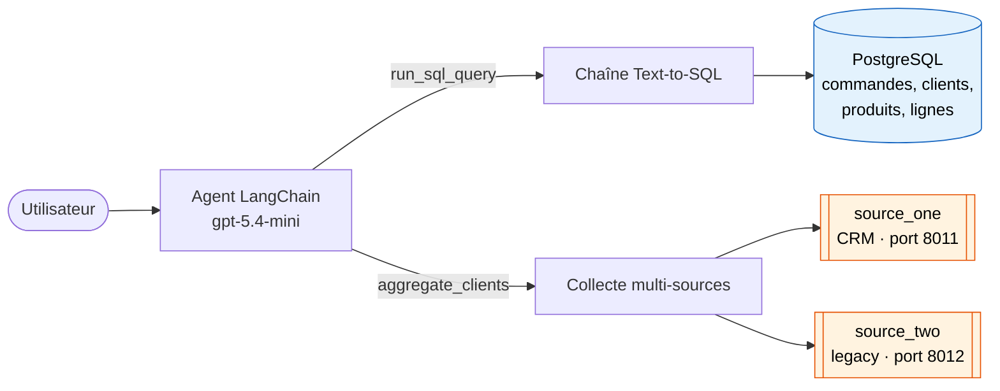
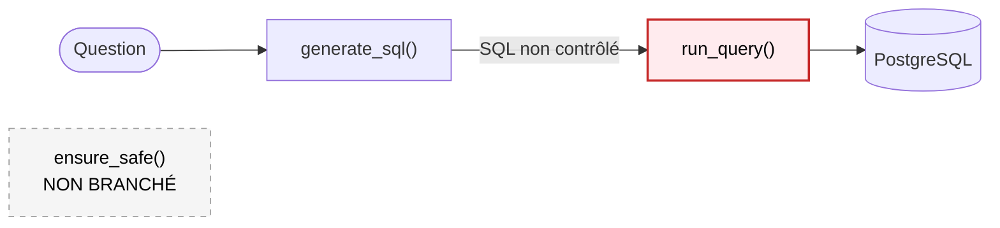
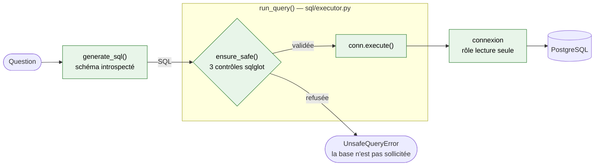
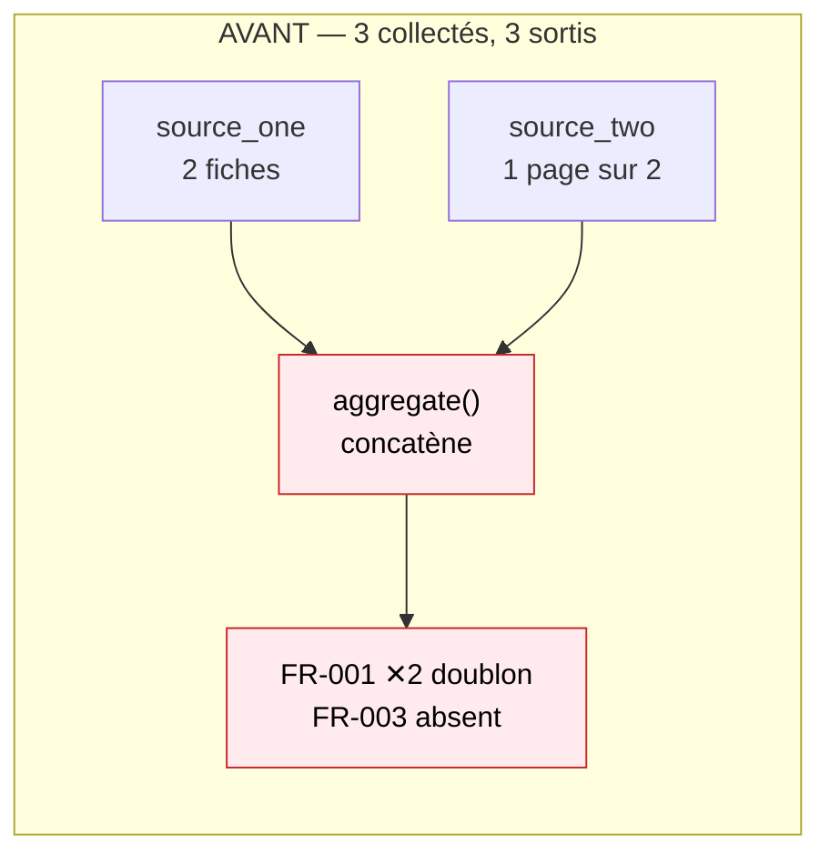
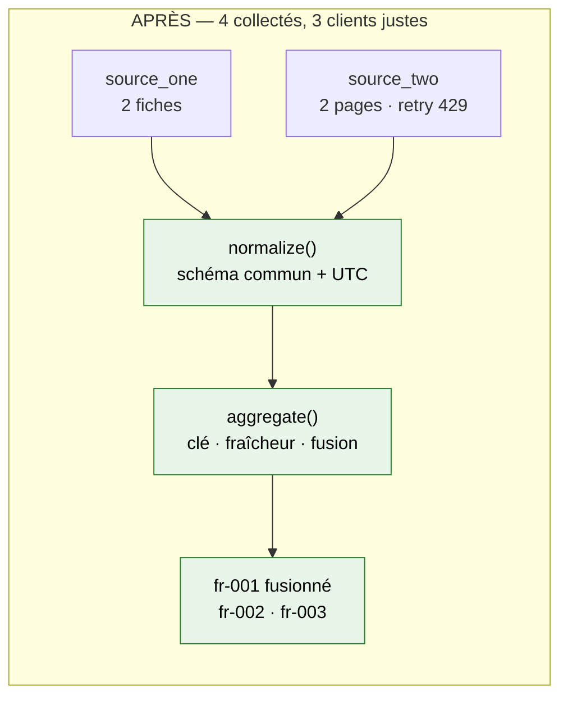

# Sorabel — présentation du projet

> [README](../README.md) · [Diagnostic](note-diagnostic.md) · [Conception](note-conception.md) · **Présentation** · [Prise en main](prise-en-main.md) · [Journal](../JOURNAL.md) · [Brief](../brief-agent-text-to-sql.md)

**Mission.** Connecter un agent conversationnel aux données de l'entreprise, de
façon sécurisée. L'agent traduit des questions en français en requêtes SQL, et
consolide en parallèle des données venues de deux applications externes.

**État de départ** : requêtes SQL non contrôlées, agrégation produisant des
doublons, harnais de tests inopérant — 13 tests en échec.
**État final** : 20 tests au vert, 8/8 requêtes dangereuses bloquées.

---

## 1. Architecture — trois systèmes, deux outils

Les données de Sorabel vivent dans trois systèmes distincts. L'agent dispose
d'un outil par famille de source.



Le choix de l'outil repose entièrement sur les **docstrings** exposées au LLM
— [agent/tools.py](../agent/tools.py).

---

## 2. Chaîne Text-to-SQL — avant / après

### Avant



`ensure_safe()` existait, était testé, documenté — et n'était appelé nulle part
dans le code de production. Même appelé, il n'aurait rien refusé : il détectait
les mots-clés d'écriture puis exécutait `pass` au lieu de lever.

### Après



**Le garde-fou est *dans* `run_query()`**, en première instruction — pas avant,
pas après. C'est ce qui le rend non contournable : placé chez l'appelant, chaque
appelant pourrait l'oublier ; placé au point d'exécution, aucun chemin n'y
échappe. Une requête refusée n'atteint jamais la connexion.

**Deux couches complémentaires** : le garde-fou applicatif *filtre*, le rôle
PostgreSQL *garantit*. Le rôle ne bloque pas la lecture de
`information_schema` ; le garde-fou si. Aucune ne remplace l'autre.

| Contrôle | Règle | Code |
|---|---|---|
| ① Instruction unique | `sqlglot.parse()` renvoie 1 élément | [guard.py](../sql/guard.py) |
| ② Lecture seule | **allowlist** — seul `SELECT` | idem |
| ③ Périmètre | tables ⊆ `ALLOWED_TABLES`, alias de CTE exclus | idem |

---

## 3. Agrégation multi-sources — avant / après





Le compte tombait juste **par compensation** : un doublon masquait un client
absent. Un chiffre exact sur une liste fausse — exactement le défaut silencieux
que le brief demandait de traquer.

| Règle | Implémentation |
|---|---|
| Clé de regroupement | `strip()` + `lower()` — `" fr-001 "` = `"FR-001"` |
| Fraîcheur | dates **parsées** en UTC — évite le `TypeError` entre naïve et aware |
| Fusion | valeur renseignée prime sur valeur vide, du plus frais au plus ancien |

Code : [sources/aggregate.py](../sources/aggregate.py) ·
[sources/base.py](../sources/base.py) ·
[sources/source_two.py](../sources/source_two.py)

---

## 4. Arborescence

```
sorabel-data-ko/
│
├── agent/                    Agent LangChain
│   ├── agent.py              construction (prompt système + outils)
│   ├── tools.py              run_sql_query · aggregate_clients
│   ├── llm.py                client Azure — route OpenAI-compatible
│   └── chat.py               REPL  (make chat)
│
├── sql/                      Chaîne Text-to-SQL
│   ├── generator.py          question → SQL, schéma introspecté
│   ├── guard.py              3 contrôles sur arbre sqlglot
│   └── executor.py           point d'application des garde-fous
│
├── sources/                  Collecte et consolidation
│   ├── base.py               client HTTP · retry 429 · dates UTC
│   ├── source_one.py         CRM — liste simple
│   ├── source_two.py         legacy — paginé
│   └── aggregate.py          dédoublonnage · fraîcheur · fusion
│
├── db.py                     schéma SQLAlchemy · engines
├── seed.py                   alimentation de la démo    (make seed)
├── roles.py                  rôle PostgreSQL lecture seule (make roles)
├── evaluation.py             chargement du jeu de test
│
├── ui/app.py                 banc d'essai Streamlit      (make ui)
├── recettes/                 recette du seed · campagne Text-to-SQL
├── mock_sources/             FastAPI — simule les 2 sources
├── data/questions_test.json  jeu de référence (Q + SQL + valeur)
├── tests/                    20 tests pytest
└── docs/                     diagnostic · conception · présentation
```

### Points d'entrée du code

| Question | Fichier |
|---|---|
| Comment le SQL est-il validé ? | [sql/guard.py](../sql/guard.py) |
| Où le contrôle s'applique-t-il ? | [sql/executor.py](../sql/executor.py) |
| Comment le schéma est-il transmis au LLM ? | [sql/generator.py](../sql/generator.py) |
| Comment les doublons sont-ils fusionnés ? | [sources/aggregate.py](../sources/aggregate.py) |
| Comment la pagination est-elle suivie ? | [sources/source_two.py](../sources/source_two.py) |
| D'où vient la protection moteur ? | [roles.py](../roles.py) |

---

## 5. Résultats

| Critère du brief | Avant | Après |
|---|---|---|
| Requêtes valides et sûres | **0/8** bloquées | **8/8** · 7/7 légitimes acceptées |
| Réponses chiffrées exactes | 4/4 | **4/4** maintenu |
| Agrégation sans doublon ni périmé | 3 → 3 (1 doublon, 1 absent) | **4 → 3 clients justes** |
| Suite de tests | 13 échecs | **0 échec / 20** |

### Le constat qui a orienté le travail

Le brief annonce « l'agent renvoie des chiffres faux ». Mesure sur le jeu
fourni : **4/4 exactes**. Le symptôme n'était pas reproductible par la voie
Text-to-SQL — dont le risque réel est de **sécurité**. Les chiffres faux
venaient de l'agrégation.

D'où l'ajout de 8 questions adverses : un jeu de test composé de questions
légitimes ne peut pas révéler un défaut de sécurité.

### Limites assumées

- Les 8 questions adverses ne proviennent pas d'un référentiel d'attaques ;
  la liste n'est pas exhaustive (injection par valeurs, `UNION`, requêtes
  coûteuses).
- Le comportement transactionnel a été mesuré sur SQLite, pas sur PostgreSQL.
- Les mesures dépendent d'un modèle donné — raison de plus pour que la sécurité
  ne repose pas sur le comportement du LLM.

---

## Démonstration

```bash
make up && make seed && make roles     # infrastructure
make ui                                # http://localhost:8501
```

| Onglet | Montre |
|---|---|
| **Recette** | les 4 questions, au choix SQL de référence ou SQL généré |
| **Bac à sable** | saisie libre — génération, garde-fou, exécution séparés |
| **Diagnostic** | verdicts mesurés au chargement, non recopiés |

Campagne complète : `uv run python recettes/campagne_texttosql.py`
